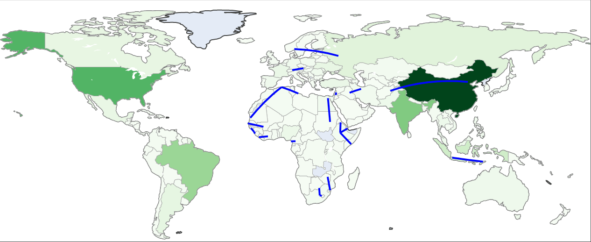
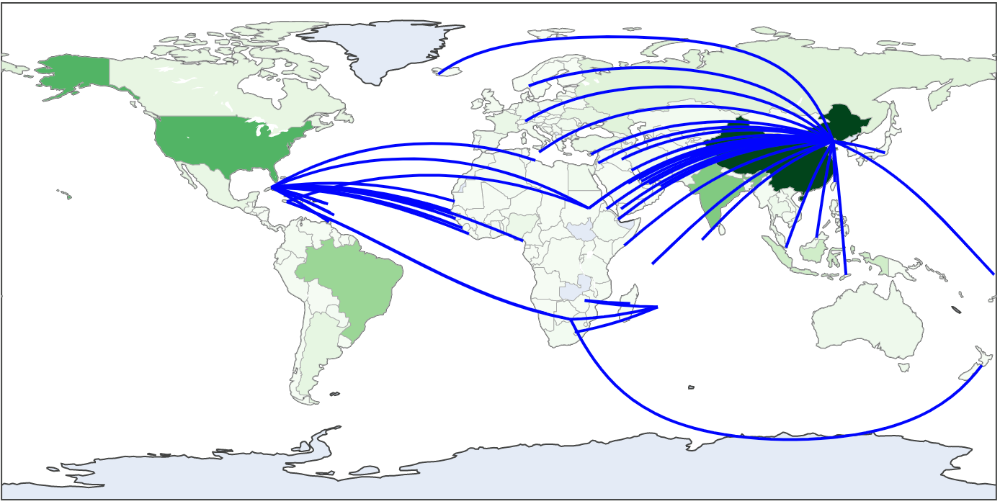

# Food Fill Algorithm Project | Team Thoughts for Food

> NASA Space App COVID-19 Hackathon

## Our Process

As we have pinpointed the problems that we were trying to solve, we discovered that food is essential, yet many countries cannot produce adequate calories to satisfy the consumption need of their citizens.

We began by gathering raw data from publicly accessible and trustworthy sources and used prominent tools for data science and visualisation, i.e., Python and Jupyter to process the data and compute the results.

## Results

We have visualised the production, the consumption, and the net margin of all countries around the world to observe and compute the optimal solution for the countries to share their excess production to neighbours.

||||
|---|---|---|
|The map showing the production of countries|The map showing consumption of countries|The map showing net margin of countries|

## Suggested Solutions

From our algorithms, we limit sharing their productions to only their neighbours for the facts that it is appropriate in the current pandemic time. We can see that many countries have capacity and ability to share their resources with their friends.

If production sharing is not limited to only neighbouring countries, China, as anticipated, who is currently the world's largest calories producer, is capable of sharing her resources to other countries in need.

|||
|---|---|---|
|The map showing the suggested solutions with the only-neighbour constraint|The map showing the suggested solutions when any country can send to anywhere in the world|

## Team Members

1. [Rawin Assabumrungrut](https://www.linkedin.com/in/rawias)
2. [Phumrapee Pisutsin](https://www.linkedin.com/in/phumrapee)
3. [Thammarith Likhittheerameth](https://www.linkedin.com/in/thammarith)
4. [Nattapak Darumas](https://www.linkedin.com/in/ndarumas)
()
